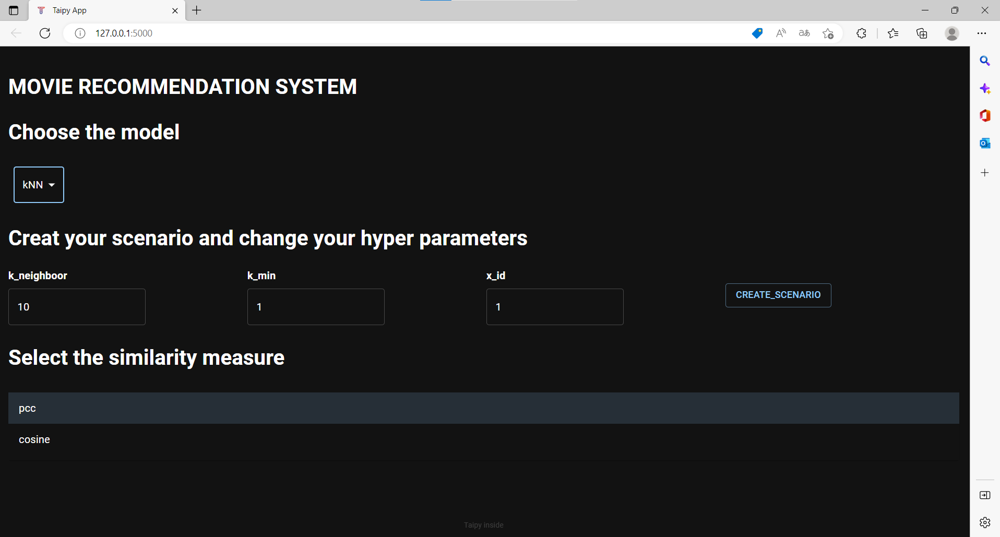
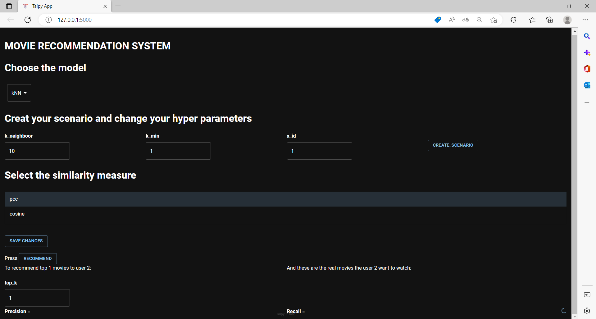

# Movie Recommendation system application using Taipy
- In the application, the user's information is secured as `user_id`.
- The app recommends **top_k** movies for a user via user_id, also give the **top_k actual** movies that the user is interested in.
- There are 2 models used to make recommendations: *kNN* and *MF*
- There are two metrics to evaluate the performance of the model: *recall* and *precision*. These are calculated automatically after making recommendations

## Run the application on a local machine
- Step 1: Clone this repo to the computer.
At the conmmand prompt, type  
<code>git clone https://github.com/caotuannghia20/recsys-taipy-app.git </code>
 - Step 2: Download the dataset [here](https://drive.google.com/file/d/1E_6jSGexFkjQmECkXEoegsp1KzoeOS4C/view?usp=sharing)
 - Step 3: Edit the dataset path in **config/config.py**
 - Step 4: Install the requirements enviroment, type :  
 <code>pip install -r requirements.txt </code>
 - Step 5: At the conmmand prompt, type :  
 <code>python main.py</code>   to run the application on a local machine
## Use the application
After run the application:

 We choose the model to make recommendations

Suppose to choose the model kNN, the display shows the parameters of the kNN model, we adjust or keep the default value. And then click **CREATE_SCENARIO** to sumbit the parameters and create model, 
similar to the MF model.

After create model, the prediction section will appear.

Adjust the **top_k** movies want to recommend and click **RECOMMEND** to show the results. The results include **top_k** movies recommendations for a user via user_id, the **top_k actual** movies that the user is interested in, the metrics ranking *recall* and *precision*.

# Notice:
If you want to change the model or model's parameters, you adjuts and click the **SAVE CHANGES** button.